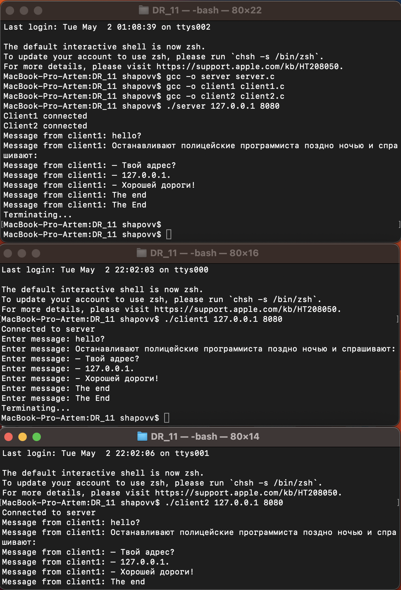

# ДР_11
## Шаповалов Артём | БПИ-217

**Задание**

Разработать клиент-серверное приложение, использующее TCP/IP и реализующее следующие взаимодействия: клиент №1 передает сообщения серверу, который перенаправляет их клиенту №2.

В качестве исходных данных задавать: IP-адрес сервера, порт сервера. Эти данные можно задавать либо в командной строке, либо с использованием функций стандартного ввода.

Передаваемое сообщение задается из стандартного ввода в цикле. То есть, можно передать не одно а несколько сообщений от клиента №1 клиенту №2. При передаче сообщения «The End» необходимо завершить работу как клиентов, так и сервера.

Приложение должно функционировать в конфигурациях от одного до трех компьютеров с различными комбинациями размещения клиентов и сервера.

**Решение**

Реализованы три программы: сервер - [server.c](server.c), клиент №1 - [client1.c](client1.c) и клиент №2 - [client2.c](client2.c)

Комментарии содержатся в соответствующих файлах программ.

**Компиляция и запуск исполняемых файлов:**

Сначала важно скомпилировать и запустить программу сервера, а потом клиентов.

В первом окне терминала:
```{c}
gcc -o server server.c
gcc -o client1 client1.c
gcc -o client2 client2.c
./server 127.0.0.1 8080
```
Во втором окне терминала:
```{c}
./client1 127.0.0.1 8080
```
В третьем окне терминала:
```{c}
./client2 127.0.0.1 8080
```
Для запуска на нескольких компьютерах необходимо указать IP-адрес устройства, на котором запускается сервер и любой свободный порт.

**Пример работы программы:**



